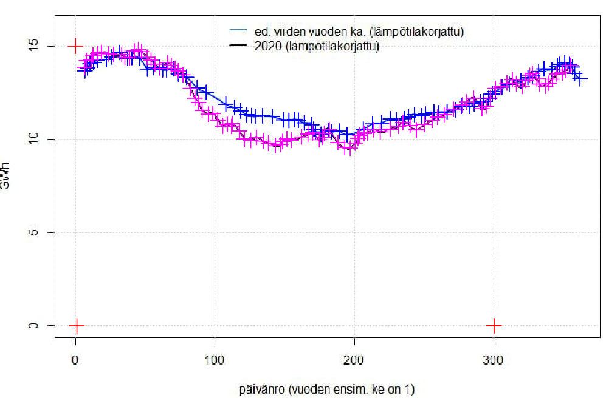

# Helen 2020 data

### What is this? 

Data from Helen Sähköverkko Oy. The temperature corrected consumption electricity. 
- 2014-2019 average values (Gwh)
- 2020 values (GWh)

The second plot is the change in the consumption in %. (positive values indicate that consumption was greater during 2020) 

<iframe frameborder='0' scrolling='no' src='https://np-8.github.io/helen-2020-consumption-data/plot.html'  style="border:none;width:1000px; height: 1100px; " ></iframe>

### Raw data

Original source of the data is a picture posted [here](https://www.facebook.com/groups/587136934970543/permalink/1353368221680740/). The data was extracted from the picture with [Engauge digitizer](https://markummitchell.github.io/engauge-digitizer/). See [helen2020.dig](helen2020.dig) for the digitizer file and the picture below for digitization outcome. The raw data is located at [helen2020-raw.csv](helen2020-raw.csv), and the final data file at [helen2020.csv](helen2020.csv). An educated guess for the accuracy (with ~90% certainty) of digitization is roughly 0.7 days (x-direction) and 0.05 GWh (y-direction). Even better accuracy could perhaps be obtained by enlarging the image before digitization.

### Creating the plots

Run `python show.py` (requirements are listed in `requirements.txt`).
