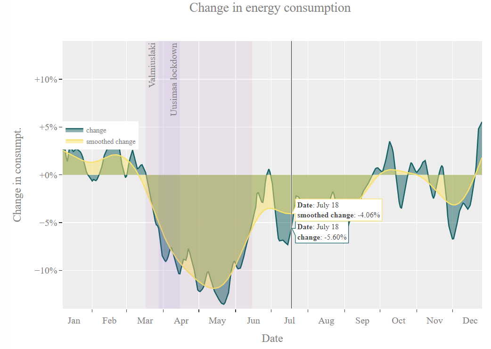

# Helen 2020 data

***(Click the figure for interactive plot)***

### What is this? 

Data from Helen Sähköverkko Oy. The temperature corrected consumption electricity. 
- 2014-2019 average values (Gwh)
- 2020 values (GWh)

The second plot is the change in the consumption in %. (positive values indicate that consumption was greater during 2020) 
### Raw data

The data was extracted with [Engauge digitizer](https://markummitchell.github.io/engauge-digitizer/). See [helen2020.dig](helen2020.dig) for the digitizer file [helen2020-raw.csv](helen2020-raw.csv) for raw data and [helen2020.csv](helen2020.csv) for final data file. A dedicated guess for the accuracy (with ~90% certainty) of digitalization is roughly 0.7 days (x-direction) and 0.05 GWh (y-direction). Even better accuracy could be done by enlarging the image before digitalization.

### Creating the plots

Run `python show.py` (requirements are listed in `requirements.txt`).